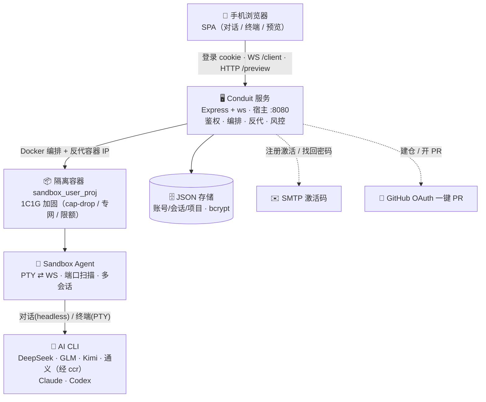

# Cloud AI Bridge · 手机遥控云端 AI 编程

> 把手机变成云端 AI 编程遥控器。登录平台、绑定自己的模型 Key，在手机上指挥 AI 在**隔离的云端 Docker 沙箱**里写代码、跑项目、测网页、推 Git——随时随地，开箱即用。

**License:** MIT OR Apache-2.0（任选其一）· 详见 [LICENSE-MIT](LICENSE-MIT) / [LICENSE-APACHE](LICENSE-APACHE)、贡献见 [CONTRIBUTING.md](CONTRIBUTING.md)、安全见 [SECURITY.md](SECURITY.md)。

## ✨ 特性
- **手机优先**：对话模式像聊天一样发指令，AI 回成气泡；也可切网页终端手敲命令。
- **隔离沙箱**：每用户每项目一个加固 Docker 容器（cap-drop / no-new-priv / 限额 / 专网 / 出网加固），互不干扰。
- **多模型自带 Key**：DeepSeek · GLM 智谱 · Kimi · 通义 · Claude · Codex，自由切换；各模型独立会话、多对话可切换。
  - 🌏 **部署在中国大陆/香港时推荐用国产模型**（DeepSeek/GLM/Kimi/通义），稳定无地区限制；Claude/Codex 受 Anthropic·OpenAI 地区策略限制可能连不通。
- **网页实时预览**：起 dev server 一键预览，多端口切换、刷新、临时分享链接。
- **Git / GitHub**：Git 助手一键复制命令；连接 GitHub 可一键建仓 / 开 PR。
- **多人协作**：邀请伙伴进同一项目，多人 + 多 AI 共建，文件互斥锁防覆盖。
- **作品社区**：自愿把项目公开供观赏（仅观赏 / 可获取）。
- **生命周期**：邮箱注册激活、到期自动备份、活跃续期、超期销毁；管理员后台 + 运营埋点 + IP/资源风控。

> 说明：界面文案/默认风格仍带「Claude 风」是历史原因；实际支持上述全部模型。

## 架构

```
手机浏览器 (Claude 风格 SPA)
  │  登录(cookie 会话) · 选项目 · WS /client?projectId · HTTP /preview/<proj>/<port>
  ▼
Conduit Server  (Express + ws，跑在宿主机 :8080)
  │  账号/会话/项目存储(JSON+bcrypt) · 按(用户,项目)映射到服务端私有 channelToken
  │  Docker 编排 · 按 agent 上报的容器 IP 反代网页预览
  ▼
每用户每项目一个容器  sandbox_<user>_<project>
  └─ Sandbox Agent: PTY(bash) ⇄ WS · 预装 claude / codex · 上报监听端口与容器 IP
```



- **指令逐字透传**：手机发的内容以 `{event:'input'}` 写入容器内 PTY。无论里面跑的是 `claude`、`codex` 还是普通 shell，都是被遥控对象。
- **凭证私有**：浏览器永远拿不到 `channelToken`；客户端 WS 用会话 cookie + projectId 鉴权，服务端再映射到容器 token。

## 目录

| 路径 | 作用 |
|---|---|
| `conduit/src/index.js` | Conduit：HTTP/WS、鉴权、编排、预览反代 |
| `conduit/src/auth.js` | 账号 / 会话 / 项目 / 凭证（`conduit/data/users.json`，bcrypt） |
| `conduit/src/orchestrator.js` | Docker 编排：镜像自动构建、容器生命周期、凭证目录挂载 |
| `conduit/public/` | 前端（Claude 暖色浅色风格 SPA） |
| `sandbox/Dockerfile` | 沙箱镜像（Node + git + claude-code + codex + agent） |
| `sandbox/agent/src/index.js` | 容器内守护进程：PTY ⇄ WS、端口扫描、上报容器 IP |

## 本地跑（MOCK 模式，无需 Docker）

```bash
npm run install-all
node start-dev.js          # 端口冲突可用：PORT=8090 node start-dev.js
```

- 自动创建开发账号 **dev / devpass** 和项目 **demo**，并在本机起一个 agent。
- 浏览器打开 `http://localhost:8080` → 用 `dev / devpass` 登录 → 选 `demo` →【激活并连接沙箱】→ 发指令即遥控本机 shell。
- 自检：另开终端 `npm run test:conduit`（或 `PORT=8090 node test-conduit.js`），覆盖登录/鉴权闸门/逐字回显/路径穿越防护/备份/销毁。
- UI 截图回归：`node e2e-test.js`（puppeteer-core，iPhone 视口，截图存 `./screenshots`）。

> Windows 宿主机上 node-pty 的 ConPTY 可能报 `AttachConsole failed`，agent 会自动退化为原生 shell（已加代次守卫与重启节流，不会刷进程）。Linux/Docker 下走正常 PTY，无此问题。

## 多人 Docker 模式（生产）

前置：宿主机装好 Docker 且守护进程在跑。

```bash
npm run build:image        # = docker build -t sandbox-image:latest sandbox
npm run install-all
npm run conduit            # 启动 Conduit（监听 8080）
```

- Conduit 检测到 Docker 可用即进入 DOCKER 模式；镜像缺失会在首个 `/api/sandbox/start` 时**自动构建**（也可先手动 `build:image`）。
- 多个用户分别注册/登录，各自【激活并连接】→ 各起一个独立容器（`docker ps` 可见 `sandbox_<user>_<project>`，免费档 1C/1G）。
- **绑定模型账号**两种方式：
  1. 设置页「模型 / 账号」填 API Key（Anthropic / OpenAI / DeepSeek）→ 注入容器环境变量。
  2. 会员号：先连接沙箱，在【设置 → 模型 / 账号】点击 Claude/Codex 登录，到终端完成 OAuth 设备码登录；凭证写入挂载的 `~/.claude` / `~/.codex`，跨重启保留。
- **DeepSeek**：填 DeepSeek API Key 后，agent 会自动写好 claude-code-router 配置（`~/.claude-code-router/config.json`，默认 `deepseek-chat`，也可切 `deepseek-reasoner`）；对话模式选 DeepSeek 即走 `ccr code`。Codex 保持 OpenAI/Codex 路径，不再写 DeepSeek provider 到 Codex 配置。

## MVP 能力：生命周期 / 邀请码 / 配额 / 预览 / 管理员

- **项目生命周期 + 自动清理**：每个项目有 `status / expiresAt / retentionUntil / lastActiveAt`。后台 CleanupWorker 定时扫描：到期(默认 5 天)→ 停容器 + 自动备份(状态 `BACKED_UP`)；超保留期(默认再 10 天)→ 删容器/workspace/备份(状态 `DESTROYED`)。即使用户不开网页也会执行。
- **邮箱激活注册 + 配额**：注册填邮箱→收 6 位激活码→激活才能登录(SMTP 发送，未配置则 dev 模式打码到控制台)；每 IP 每天注册限频；每用户每天最多建 1 个项目、同时最多 1 个运行中免费项目(管理员豁免)。
- **临时预览链接**：`POST /api/preview` 生成带过期(默认 30 分钟)的可分享链接 `/preview/<proj>/<port>/?pt=<token>`；每项目最多 3 个；非所有者凭 token 访问，所有者凭会话 cookie 访问。
- **管理员后台** `/admin.html`：用户/项目/容器总览、生成/禁用邀请码、封禁用户、停止/销毁项目、撤销预览链接、运行时切换全局开关。管理员由 `ADMIN_USERS` 指定。
- **容器加固**：免费档 `1 CPU / 1GB / pids-limit 256`、`cap-drop=ALL`、`no-new-privileges`、专用 `ai-sandbox-net` 网络、`restart=no`；**绝不**使用 privileged / host network / 挂载 docker.sock。
- **出网加固**(宿主机层)：`deploy/harden-network.sh` 在服务器上以 root 运行，阻断容器访问云元数据 `169.254.169.254` 与外发 SMTP（RFC1918 规则默认注释，开启前需放行 agent→Conduit）。

## 环境变量

| 变量 | 默认 | 说明 |
|---|---|---|
| `PORT` | 8080 | Conduit 监听端口 |
| `COOKIE_SECURE` | 0 | HTTPS 反代后置 1，会话 cookie 带 Secure |
| `ADMIN_USERS` | `dev` | 管理员用户名（逗号分隔） |
| `REGISTRATION_ENABLED` | 1 | 是否开放注册（可在后台运行时切换） |
| `SMTP_HOST`/`SMTP_PORT`/`SMTP_SECURE`/`SMTP_USER`/`SMTP_PASS`/`SMTP_FROM` | — | 邮箱激活码发送（QQ/163/Gmail 应用密码或专业邮件服务）；未配置则 dev 模式打码到控制台 |
| `ACTIVATION_TTL_MS`/`RESEND_INTERVAL_MS` | 900000/60000 | 激活码有效期 / 重发最小间隔 |
| `INVITE_REQUIRED` | 1 | （已弃用）注册改走邮箱激活；保留兼容 |
| `PROJECT_CREATION_ENABLED` / `FREE_TIER_ENABLED` | 1 | 创建项目 / 免费档开关 |
| `FREE_RUN_HOURS` | 48 | 运行期（小时，公开测试默认 48h）；设 `0` 则回退用 `FREE_RUN_DAYS` |
| `FREE_RUN_DAYS` / `RETENTION_DAYS` | 5 / 10 | 运行期（天，仅当 `FREE_RUN_HOURS=0`）/ 备份保留期（天） |
| `DISK_WARN_PCT` / `DISK_BLOCK_PCT` | 80 / 90 | workspace 分区告警 / 自动停新建·激活阈值（%） |
| `MAX_RUNNING_FREE` / `MAX_CREATE_PER_DAY` | 1 / 1 | 并发运行 / 每日创建配额 |
| `MAX_REGISTER_PER_IP_PER_DAY` | 3 | 每 IP 每天注册上限（风控）|
| `MAX_WS_PER_USER` | 4 | 每用户并发 WebSocket 上限（防滥用）|
| `EGRESS_LIMIT_MB` | 2048 | 单容器出站流量上限，超则自动停（0=不限）|
| `WORKSPACE_QUOTA_MB` | 2048 | 单 workspace 磁盘软配额，超 1.5× 自动停（0=不限）|
| `BACKUP_MAX_MB` | 1024 | 单备份体积上限，超则删除并报错（0=不限）|
| `MAX_BODY` | 512kb | 请求体大小上限 |
| `HERMES_FEATURE_ENABLED` | 1 | Hermes 云端秘书平台总开关（0 关闭整个功能）|
| `PUBLIC_BASE_URL` | — | 平台公开根地址（用于拼 OAuth 回调）|
| `GITHUB_OAUTH_CLIENT_ID`/`GITHUB_OAUTH_CLIENT_SECRET`/`GITHUB_OAUTH_SCOPE` | —/—/repo | GitHub OAuth App（一键连接/建仓/开 PR）；不填则功能隐藏 |
| `RESOURCE_GUARD_INTERVAL_MS` | 120000 | 出站/磁盘巡检间隔 |
| `PREVIEW_TTL_MIN` / `MAX_PREVIEW_PER_PROJECT` | 30 / 3 | 预览链接有效期（分钟）/ 每项目上限 |
| `CLEANUP_INTERVAL_MS` | 300000 | CleanupWorker 扫描间隔 |
| `SANDBOX_NETWORK` | `ai-sandbox-net` | 容器所在 Docker 网络 |
| `AI_SANDBOX_WORKSPACE_BASE` / `AI_SANDBOX_BACKUP_BASE` / `AI_SANDBOX_DATA_DIR` | 仓库内相对路径 | 部署到 `/opt/ai-sandbox/...` 时覆盖 |
| `AI_SANDBOX_COMMUNITY_DIR` | 仓库内 `conduit/community` | 社区快照目录（部署时建议指到 `/opt/ai-sandbox/community`）|

## 部署到远程 Linux 服务器

对照东京服务器目录 `/opt/ai-sandbox`：

```bash
# 1) 代码与依赖
cp -r app /opt/ai-sandbox/app && cd /opt/ai-sandbox/app
npm run install-all && npm run build:image
sudo bash deploy/harden-network.sh           # 出网加固（元数据/SMTP）

# 2) 环境（指向 /opt/ai-sandbox 的标准目录 + 设管理员）
export AI_SANDBOX_WORKSPACE_BASE=/opt/ai-sandbox/workspaces
export AI_SANDBOX_BACKUP_BASE=/opt/ai-sandbox/backups
export AI_SANDBOX_DATA_DIR=/opt/ai-sandbox/data
export ADMIN_USERS=你的管理员用户名
export COOKIE_SECURE=1                        # 配合前置 HTTPS

# 3) 常驻（pm2 或 systemd），前面挂 Nginx/Caddy 做 HTTPS 反代到 :8080
pm2 start conduit/src/index.js --name conduit
```

第一次登录请用 `ADMIN_USERS` 指定的账号注册（首个邀请码可临时设 `INVITE_REQUIRED=0` 注册后再改回），进 `/admin.html` 生成邀请码发给测试用户。

> **预览反代假设**：Conduit 直连容器 IP（`agent` 上报的 `eth0`）。这在 Linux 宿主成立。Windows/Mac Docker Desktop 宿主无法直接路由容器 IP，预览功能需另做端口映射（本原型未覆盖）。

## 安全说明（原型取舍）

- 注册默认需邀请码 + 全局开关（`INVITE_REQUIRED` / `REGISTRATION_ENABLED`，后台可运行时切换）。
- API Key 以明文存于 `data/users.json`（文件权限 0600）。要更稳妥应做静态加密或交给密钥管理服务（KMS/Vault）。
- 会话持久化到磁盘（`data/sessions.json`，0600，带 TTL），**Conduit 重启不掉登录**；封禁用户会即时失效其会话。
- 已落实：跨用户越权 + `projectId` 路径穿越防护；密钥不回显；容器加固(1C1G/pids/cap-drop/no-new-priv/专用网络)；自动过期/备份/销毁；出网加固脚本；管理员资源监控(CPU/内存/磁盘/网络/运行时长)。
- 风控与防滥用：IP 封禁 + 每 IP 注册限频；每用户并发 WS 上限；容器出站流量超限自动停；workspace 磁盘软配额；分区磁盘压力保护。
- 运营埋点(§10)：失败登录、IP 注册拦截、预览点击、平均使用时长、转化漏斗（注册→创建→激活→终端→Git→预览→备份），后台可视化。
- Hermes 云端秘书(§7，默认关闭)：每用户独立加固 sidecar、预算/连接器/工具权限治理、跨用户隔离、admin 一键停。架构与扩展见 [docs/hermes.md](docs/hermes.md)。
- GitHub OAuth 一键：连接 GitHub → 一键建仓 / 提交并开 PR（host 侧执行，token 不进容器、不回显、push 不写入 .git/config）。配置见 [docs/git-guide.md](docs/git-guide.md)。
- 协作房间(v1)：房主邀请协作者，多人共享同一沙箱/终端/预览，消息实时广播；**文件互斥锁**（同一文件不可被两人同时持有，锁信息注入各 AI 上下文，避免互相覆盖）。见 [docs/collaboration.md](docs/collaboration.md)。
- 社区：用户自愿把项目公开到社区供众人观赏（仅本人可发布、需邮箱激活）；发布即对工作区做**只读快照**（沙箱到期也能看），作者选「仅观赏 / 可获取」；观赏走 `CSP: sandbox` 隔离静态服务，浏览仅登录用户，管理员可下架。见 [docs/community.md](docs/community.md)。

## 文档

新手教程与使用指南见 [docs/](docs/README.md)：上手、手机使用、AI 工具绑定、Git、预览、到期备份、安全、FAQ。

## License

本项目采用 **双许可**：你可任选 [MIT](LICENSE-MIT) **或** [Apache-2.0](LICENSE-APACHE) 使用（"MIT OR Apache-2.0"）。
贡献规则见 [CONTRIBUTING.md](CONTRIBUTING.md)（半开放：低风险层欢迎 PR，安全核心层仅 owner 审核，见 [CODEOWNERS](CODEOWNERS)）；漏洞报告见 [SECURITY.md](SECURITY.md)。
